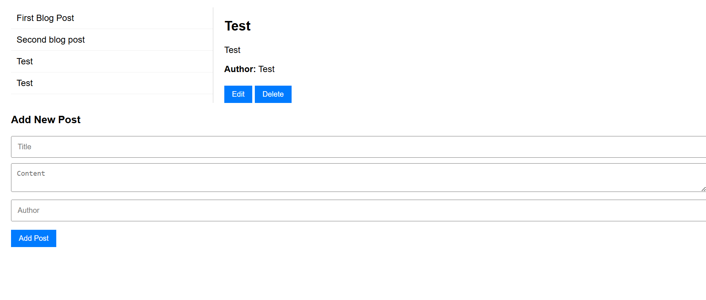

# Code Challenge 3 – Blog Post Manager

A web application for managing blog posts. Built using **HTML**, **CSS**, **JavaScript**, and a **local JSON server**. Users can view, add, edit, and delete posts with full CRUD (Create, Read, Update, Delete) functionality.

By **Cassy Omondi**

## Screenshot



## Features

- View a list of blog post titles
- Click a post to view full details (title, content, author)
- Add a new blog post using a form
- Edit an existing post's title and content
- Delete a post from the list
- All interactions are synced with the mock API in real time

## Environments Supported

This project supports **two operating modes**:

### GitHub Pages (Read-Only Mode)
- Blog posts are fetched from a static `db.json` file hosted on GitHub.
- **No** add, edit, or delete operations are allowed.
- Useful for public demos or viewing the app in action.

### Local JSON Server (Full CRUD)
- Uses [`json-server`](https://www.npmjs.com/package/json-server) to simulate a real API.
- Supports **Create, Read, Update, Delete** operations.
- Ideal for development and testing.

### Switching Modes

To toggle between the two modes:

1. Open `src/index.js`
2. Locate the following section at the top:
   ```javascript
   const baseURL = "https://evansveryown.github.io/blog-post-manager/db.json";
   // const baseURL = "http://localhost:3000/posts";
3. Comment/uncomment as needed:
- Use the GitHub URL for read-only
- Use the localhost URL for full CRUD with json-server

## How to Use

### Requirements
- A computer, phone, or tablet
- A modern web browser (Chrome, Firefox, Edge, Safari)

#### 1. Clone the repository:
```bash
git clone https://github.com/evansveryown/blog-post-manager.git

Or download the ZIP and extract it.
```

#### 2. Navigate to the project folder:
```bash
cd blog-post-manager
```

#### 3. Install JSON Server globally (if not already installed)
npm install -g json-server

#### 4. Start the local JSON server
```bash
json-server db.json
This starts the API at http://localhost:3000/posts.
```

#### 5. Start the frontend
If you have Live Server installed (e.g., in VS Code):

Right-click index.html and choose "Open with Live Server"

 --- 
 
# Author

Cassy Omondi

# License

MIT License

Copyright © 2025 Cassy Omondi

Permission is hereby granted, free of charge, to any person obtaining a copy of this software and associated documentation files (the "Software"), to deal in the Software without restriction, including without limitation the rights to use, copy, modify, merge, publish, distribute, sublicense, and/or sell copies of the Software, and to permit persons to whom the Software is furnished to do so, subject to the following conditions:

The above copyright notice and this permission notice shall be included in all copies or substantial portions of the Software.

THE SOFTWARE IS PROVIDED "AS IS", WITHOUT WARRANTY OF ANY KIND, EXPRESS OR IMPLIED, INCLUDING BUT NOT LIMITED TO THE WARRANTIES OF MERCHANTABILITY, FITNESS FOR A PARTICULAR PURPOSE AND NONINFRINGEMENT. IN NO EVENT SHALL THE AUTHORS OR COPYRIGHT HOLDERS BE LIABLE FOR ANY CLAIM, DAMAGES OR OTHER LIABILITY, WHETHER IN AN ACTION OF CONTRACT, TORT OR OTHERWISE, ARISING FROM, OUT OF OR IN CONNECTION WITH THE SOFTWARE OR THE USE OR OTHER DEALINGS IN THE SOFTWARE.